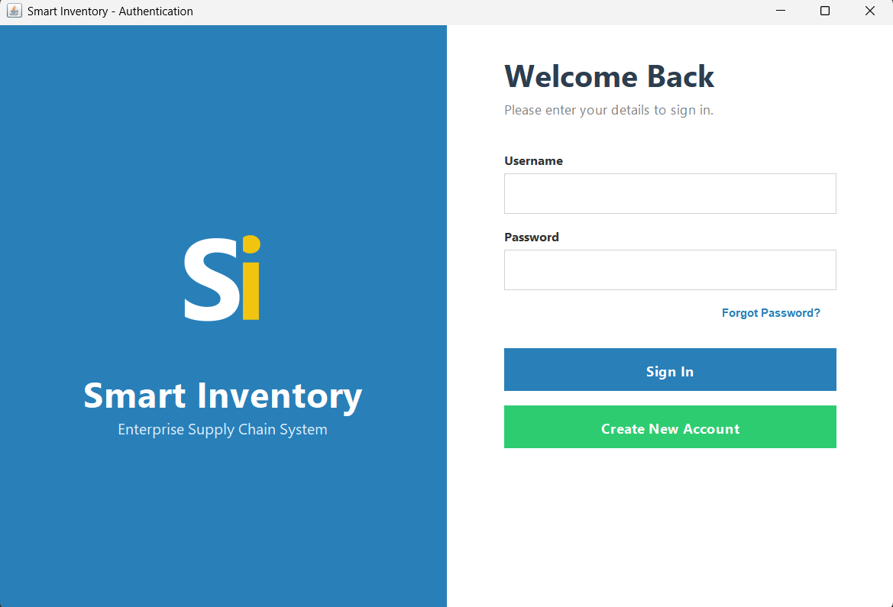
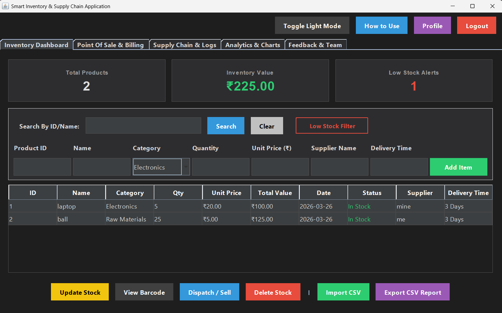
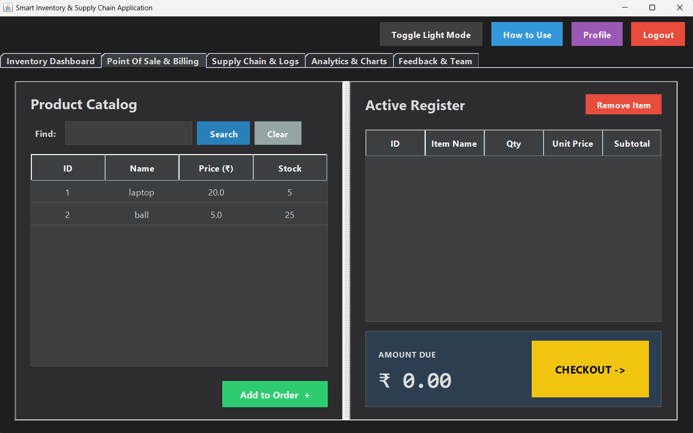
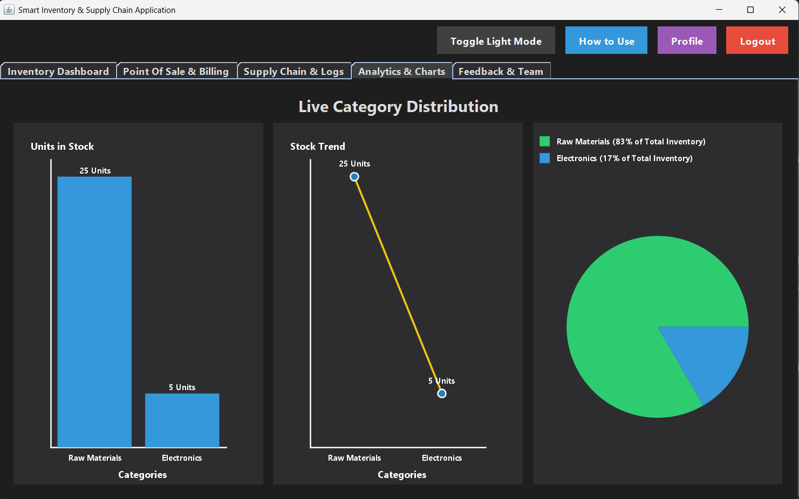
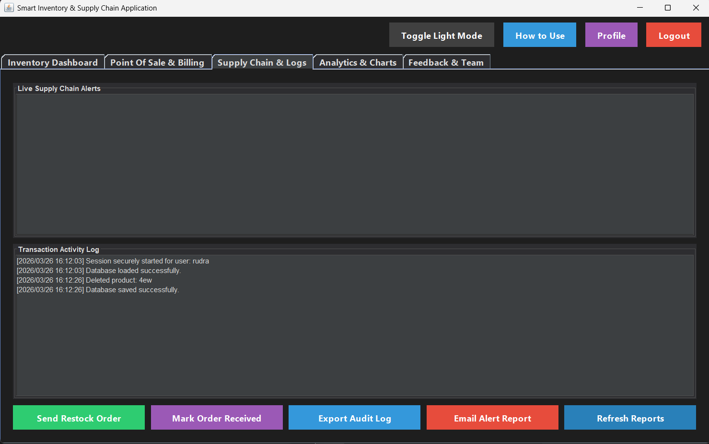
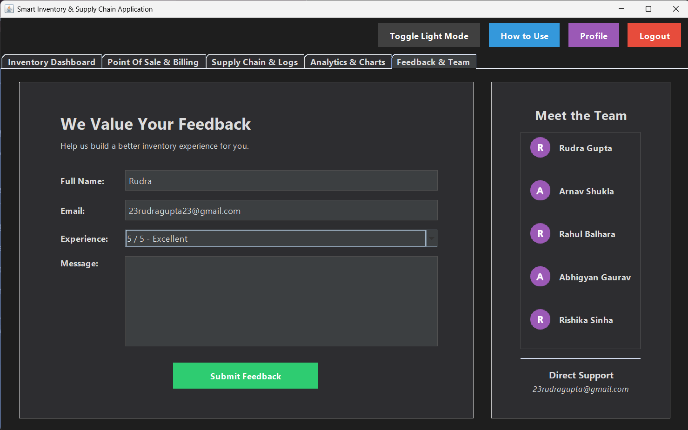

# 📦 Smart Inventory & Enterprise Supply Chain System

A comprehensive, enterprise-grade desktop application built in Java. This system seamlessly bridges the gap between backend warehouse management and customer-facing Point of Sale (POS) operations. It features real-time data analytics, automated low-stock email alerts, and a completely custom-built modern UI with Dark Mode support.

### Project Outcomes
* **Functional POS System:** A digital cash register that instantly calculates totals, deducts physical stock upon checkout, and generates official `.txt` receipts.
* **Smart Supply Chain:** The system intelligently identifies low stock, recommends reorder quantities, and logs all physical receiving events.
* **Secure Authentication:** Features a robust login system with encrypted credential storage, user-specific profiles, and a secure "Forgot Password" flow utilizing secure email OTPs.

---

## 🚀 Core Modules & Features

### 1. 🛡️ Authentication, Automatic Logout & Security
* **Auto-Lock Session Timer (Automatic Logout):** A built-in security thread continuously monitors keyboard and mouse activity. If the system is idle for 3 minutes, it automatically saves all database changes, logs the user out, and locks the workspace to protect sensitive business information.
* **Modern Split-Pane UI:** Sleek, web-style login and registration forms with live RegEx validation for email formats and phone numbers.
* **Secure Recovery:** Automated 6-digit OTP codes sent directly to user emails via Java `SSLSocket` integration for password resets.

### 2. 👤 User Profiles & Account Management
* **Custom Avatars:** Users can upload their own PNG/JPG profile pictures, which the system dynamically crops into a modern circular avatar.
* **Private Workspace:** A dedicated, auto-saving digital notepad for users to keep personal shift notes or daily reminders.
* **Permanent Account Deletion:** Users have full control over their data. The "Delete Account" function permanently erases the user's credentials and deletes their specific `inventory_username.csv` file from the local system (requires password confirmation to prevent accidental deletion).

### 3. 📖 Interactive "How to Use" Guide
* **Built-in Documentation:** A dedicated, dynamically rendered UI manual built directly into the app. It provides beautifully formatted, color-coded cards explaining how to use the Inventory, POS, Supply Chain, Analytics, and Security features—all without needing an external web browser or PDF.

### 4. 📊 Inventory Dashboard
* **Full CRUD Operations:** Add, update, and delete products with specific lead times and supplier data.
* **Smart CSV Import/Export:** Bulk upload inventory data. The system utilizes a "Smart ID Resolver" that automatically detects duplicate Product IDs and safely auto-increments them (e.g., `ITEM-1`, `ITEM-2`) to prevent data corruption.
* **Custom Barcode Generation:** Converts Product IDs into visually accurate, scannable binary Barcode images drawn entirely with `Graphics2D` and exportable as PNGs.
* **Dynamic Filtering:** Instantly isolate low-stock items (< 20 units) with a single toggle pill.
* **Direct B2B Dispatching:** Bypass the POS system for bulk wholesale orders. The "Dispatch / Sell" button allows instant stock deduction and automatically generates a dedicated, timestamped `Invoice.txt` file.
* **Dynamic Custom Categories:** Selecting "Miscellaneous" from the category dropdown triggers a smart prompt allowing users to define and inject entirely new product categories into the system on the fly.

### 5. 🛒 Point of Sale (POS) & Billing
* **Digital Register:** Split-screen interface for rapid catalog searching and cart building.
* **Safety Protocols:** Cashiers are hard-coded to be unable to sell more stock than physically available.
* **Automated Receipts:** Generates formatted, timestamped `Receipt_TXN-12345.txt` files directly to the local machine upon successful checkout.

### 6. 🚚 Supply Chain & Logging
* **Purchase Orders:** One-click restock ordering that calculates deficits to reach a 100-unit optimal stock level.
* **Audit Trails:** A non-editable, timestamped log of every action (sales, deletions, restocks) that can be exported as a secure `.txt` Audit Log.
* **Manager Alerts:** Instantly dispatches a formatted "Low Stock Alert" email to the registered manager's inbox containing items that need immediate reordering.
* **Closed-Loop Order Tracking:** Track the exact status of shipments. Items marked as "Ordered" or "Delayed" can be processed via the "Mark Order Received" button, which automatically updates the status to "Delivered" and injects the physical units into the active inventory.

### 7. 📈 Live Analytics & Feedback
* **Real-Time Rendering:** Custom-built Pie, Bar, and Line charts built completely from scratch using `Graphics2D`.
* **Instant Sync:** The exact millisecond a POS sale is completed or inventory is updated, the charts instantly redraw to reflect the new financial distributions.
* **Direct Developer Feedback:** A built-in form that allows users to rate their experience and send emails directly to the development team.

### 8. 🎨 Personalization
* **Dark Mode:** A complete UI overhaul system that dynamically repaints tables, text fields, and panels without relying on external UI libraries.
* **Dynamic Data Sorting (Ascending/Descending):** Click any table header to instantly arrange inventory data. The system intelligently sorts alphabetical data (A-Z) and numerical data (Highest-to-Lowest Quantity/Price) for rapid data analysis.
* **Multi-Parameter Smart Search:** A global search engine that instantly filters the data table not just by Product ID or Name, but also by Category and Supplier Name simultaneously.

---

## 📸 System Screenshots


| Login & Authentication | Inventory Dashboard |
| :---: | :---: |
|  |  |

| Point of Sale (Dark Mode) | Live Analytics |
| :---: | :---: |
|  |  |

| Supply Chain & Logs | Feedback & Team |
| :---: | :---: |
|  |  |

---

## 🔄 System Workflow

1. User logs in / registers an account.
2. System loads the specific `inventory_[username].csv` database for that user.
3. User can navigate through the built-in "How to Use" guide to learn the system.
4. User manages products or performs sales via the POS digital register.
5. System safely deducts stock and instantly updates live Analytics charts.
6. **Security Trigger:** If inactive for 3 minutes, the system auto-saves and forces an automatic logout to secure the terminal.
7. Users can manage their account, update avatars, save notes, or permanently delete their data via the Profile page.

---

## 🛠️ Tech Stack

- **Language:** Java
- **UI:** Java Swing, AWT
- **Database:** Multi-user CSV-based storage (File I/O)
- **Networking:** SMTP via SSLSocket
- **Graphics:** Graphics2D (Charts, Avatars, & Barcodes)
- **Version Control:** Git & GitHub


## 📁 Project Structure

```
Smart-Inventory-Management-System/
│
├── .gitignore                  # Tells GitHub to ignore compiled .class files and 
├── README.md                   # Your detailed project documentation and report
│
├── images/                     # Folder for your GitHub README screenshots
│   ├── login.png               
│   ├── dashboard.png
│   ├── pos_dark.png
│   ├── analytics.png
│   ├── logs.png
│   └── feedback.png
│
├── src/                        # Your main Java Source Code folder
│   │
│   ├── MainApp.java            # The main application window, Auth system, and UI tabs
│   ├── POSModule.java          # Point of Sale (POS) and billing digital register logic
│   ├── InventoryDatabase.java  # Core backend, File I/O (CSV), and data management
│   ├── Product.java            # Product object blueprint (ID, Name, Qty, Price, etc.)
│   ├── EmailService.java       # Secure SSLSocket logic for sending OTPs and alerts
│   │
│   ├── AnalyticsChart.java     # Custom Graphics2D component for the Bar Chart
│   ├── LineChart.java          # Custom Graphics2D component for the Line Graph
│   └── PieChart.java           # Custom Graphics2D component for the Pie Chart
│
└── [Auto-Generated Files]      # These are created automatically when the app runs
    ├── users_data.csv          # Encrypted user accounts database
    ├── inventory_rudra.csv     # User-specific inventory database
    ├── Receipt_TXN-123.txt     # Generated POS checkout invoices
    ├── Audit_Log_rudra.txt     # Exported security logs
    └── Barcode_ITEM1.png       # Exported barcode images
```

## 🧰 Prerequisites

Make sure you have the following installed:

- Java JDK 8 or higher
- Git (for cloning repository)
- Any IDE (VS Code / IntelliJ / Eclipse)

Check Java version:
```bash
java -version
```

## ⚙️ Installation & Setup

1. **Clone the repository:**
   ```bash
git clone [https://github.com/Rudragupta23/Smart-Inventory-Management-System.git](https://github.com/Rudragupta23/Smart-Inventory-Management-System.git)

## 🚀 How to Run the Project

### 📂 Step 1: Navigate to the Project Directory
```bash
cd Smart-Inventory-Management-System/src
```

### ⚙️ Step 2: Compile the Java Files
```bash
javac *.java
```

### ▶️ Step 3: Run the Application
```bash
java MainApp
```
